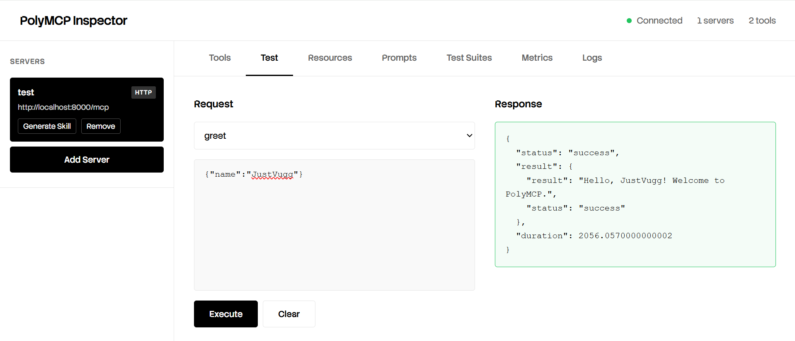

<p align="center">
  
</p>

<div align="center">

[](https://pypi.org/project/polymcp/)
[](https://pypi.org/project/polymcp/)
[](https://github.com/llm-use/polymcp/blob/main/LICENSE)
[](https://github.com/llm-use/polymcp/stargazers)
[](https://www.poly-mcp.com)

</div>

**Universal MCP toolkit + agent runtime** to expose tools, connect multiple MCP servers (HTTP/stdio), and orchestrate them with LLMs — with production controls (budgets, logs, retries, redaction).

**For who**
- Devs building **MCP servers** (Python/TypeScript) and want “tools in minutes”
- Teams shipping **agent workflows** across many tools/servers
- Anyone who needs **production guardrails** (cost, security, observability)

**What you get**
- ✅ Expose Python functions as MCP tools (HTTP, stdio, in-process)
- ✅ Unified agent to orchestrate tools across multiple servers
- ✅ PolyMCP Inspector: test/debug/monitor MCP servers in a web UI
- ✅ Security + reliability: redaction, allowlists, retries, health checks
- ✅ Skills system: load only relevant tools (token savings)
- ✅ LLM providers: OpenAI, Anthropic (Claude), Ollama, DeepSeek, Kimi (e custom providers)

---

<details>
  <summary><b>🎉 What's New</b> (open)</summary>

### PolyMCP PYTHON VERSION UPDATE

**Authentication System**
- 🔐 Pluggable auth: JWT, OAuth2 (RFC 6749), API keys, custom providers
- 🔄 Auto-refresh with exponential backoff + jitter
- 🛡️ Thread-safe token management & automatic retry on 401/403
- 🎯 Drop-in auth wrapper for UnifiedPolyAgent (no code changes needed)

**Security & Isolation**
- 🐳 Docker executor: run code in isolated containers

**Production Stdio Client**
- 🔧 Robust JSON-RPC line parsing with timeout handling
- 🛡️ Graceful shutdown: proper pipe cleanup & process termination
- 🎭 Battle-tested with Playwright, filesystem, and custom servers

**Enhanced Security & Reliability**
- 🔒 Multi-layered auth with circuit breakers
- 📊 Health checks, structured logs, and metrics
- 🔄 Transient failure retry with intelligent backoff
- 🛡️ Input validation, schema enforcement, workspace isolation

</details>

---

## Install

```bash
pip install polymcp
````

## Quickstart (60s): expose 2 tools via MCP (HTTP)

Create `server.py`:

```python
from polymcp.polymcp_toolkit import expose_tools_http

def greet(name: str) -> str:
    """Say hello."""
    return f"Hello, {name}!"

def add(a: int, b: int) -> int:
    """Add two numbers."""
    return a + b

app = expose_tools_http(tools=[greet, add], title="My MCP Tools")
```

Run:

```bash
uvicorn server:app --reload
```

You now have:

* `GET /mcp/list_tools`
* `POST /mcp/invoke/<tool_name>`

---

> **IMPORTANT: MCP base URL**
>
> When connecting an agent or generating skills, always use the MCP base path:
>
> ✅ Correct: `http://localhost:8000/mcp`  
> ❌ Wrong: `http://localhost:8000`
>
> Quick check:
> - `GET http://localhost:8000/mcp/list_tools` should return your tools list
> - `POST http://localhost:8000/mcp/invoke/<tool_name>` invokes a tool
>
> If you see `405 Method Not Allowed` on `http://localhost:8000/`, you're hitting the wrong endpoint (missing `/mcp`).


## Quickstart: run an agent that uses your tools

```python
import asyncio
from polymcp.polyagent import UnifiedPolyAgent, OpenAIProvider

async def main():
    async with UnifiedPolyAgent(
        llm_provider=OpenAIProvider(),
        mcp_servers=["http://localhost:8000/mcp"],
    ) as agent:
        out = await agent.run_async("Greet Luca and then add 5 + 10")
        print(out)

asyncio.run(main())
```

---

## Production config (safe defaults)

```python
from polymcp.polyagent import UnifiedPolyAgent

agent = UnifiedPolyAgent(
    llm_provider=llm,

    # Budget controls
    max_tokens=100000,
    max_tool_calls=20,
    max_wall_time=300.0,

    # Security
    redact_logs=True,
    tool_allowlist={"greet", "add"},

    # Observability
    enable_structured_logs=True,
    log_file="agent.log",

    # Resilience
    max_retries=3,
    enable_health_checks=True,
    enable_rate_limiting=True,

    # Architecture
    use_planner=True,
    use_validator=True,
)
```

---

## PolyMCP Inspector (test/debug/monitor)

```bash
polymcp inspector
# opens http://localhost:6274
```

**Inspector highlights**

* Multi-server dashboard (HTTP + stdio)
* Interactive tool testing + live request/response
* Metrics (latency, success rate, calls)
* Export reports (json/markdown/html)
* Test suites for regression



---

## Common workflows

### 1) Connect multiple servers (HTTP + stdio)

```python
agent = UnifiedPolyAgent(
    llm_provider=llm,
    mcp_servers=["http://localhost:8000/mcp"],
    stdio_servers=[{"command": "npx", "args": ["@playwright/mcp@latest"]}],
)
```

### 2) Stdio MCP server (Claude Desktop compatible)

```python
from polymcp import expose_tools_stdio

def calculate(a: int, b: int) -> int:
    return a + b

server = expose_tools_stdio(
    tools=[calculate],
    server_name="Math Tools",
    server_version="1.0.0"
)

if __name__ == "__main__":
    server.run()
```

### 3) Skills system (load only relevant tools)

### Generate skills (CLI)

Skills are generated by discovering tools from your MCP servers and auto-categorizing them.

#### HTTP servers
Use the MCP base URL (include `/mcp`):

```bash
polymcp skills generate --servers "http://localhost:8000/mcp" --output ./mcp_skills --verbose
````

#### Stdio servers (Playwright, filesystem, etc.)

Enable stdio discovery:

```bash
polymcp skills generate --stdio --servers "npx -y @playwright/mcp@latest" --output ./mcp_skills --verbose
```

Then enable them in your agent:

```python
agent = UnifiedPolyAgent(
    llm_provider=llm,
    skills_enabled=True,
    skills_dir="./mcp_skills",
    mcp_servers=["http://localhost:8000/mcp"],   # optional if using HTTP tools too
    stdio_servers=[{"command":"npx","args":["-y","@playwright/mcp@latest"]}],  # optional
)
```


```python
agent = UnifiedPolyAgent(
    llm_provider=llm,
    skills_dir="./skills",
    mcp_servers=["http://localhost:8000/mcp"],
)
```

---

## TypeScript implementation (PolyMCP-TS)

PolyMCP also ships a TypeScript implementation for Node/TS ecosystems:

* schema validation (Zod)
* HTTP + stdio servers
* agent framework + tooling

📖 See: `polymcp-ts/README.md`

---

## Docs & Links

* GitHub: [https://github.com/llm-use/polymcp](https://github.com/poly-mcp/polymcp)
* PyPI: [https://pypi.org/project/polymcp/](https://pypi.org/project/polymcp/)
* Website: [https://www.poly-mcp.com](https://www.poly-mcp.com)
* Examples: `examples/`

---

## Star History

[](https://www.star-history.com/#llm-use/Polymcp&type=date&legend=top-left)

## License

MIT
